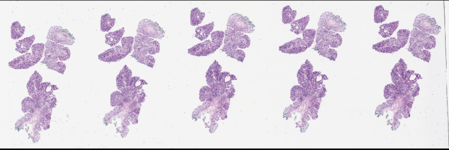
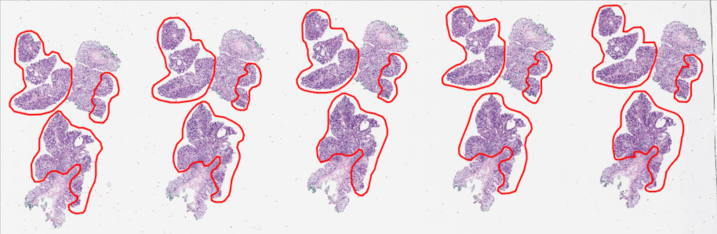
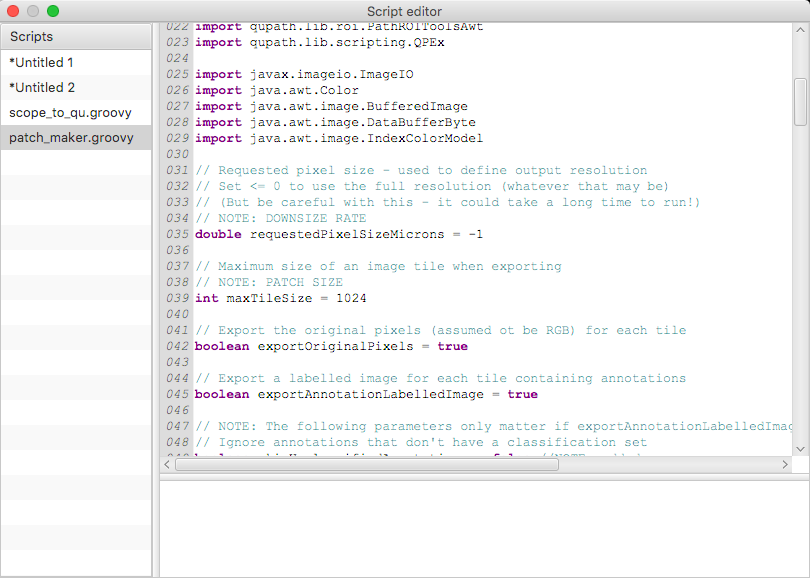
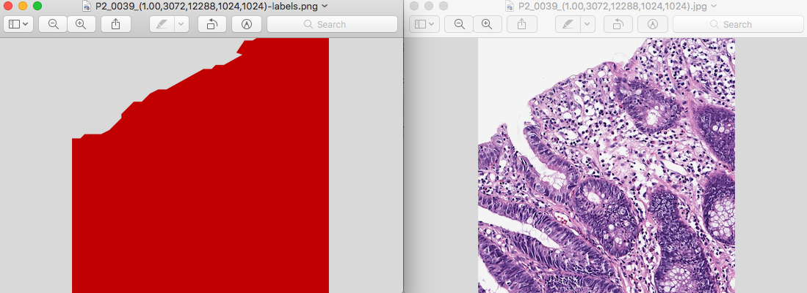

## Baseline Codes for Colorectal Cancer Segmentation

### Summary

Baseline Codes for Colorectal Cancer Segmentation

### Data Processing

#### Import Aperio-ImageScope formated image into QuPath 

1. Import original image
<p align="center"></p>

2. Run ```scope_to_qu.groovy``` via Automate-Show script editor
<p align="center"></p>

* Change following variable:
    * ```xml_file```

3. Result
<p align="center"></p>

#### Export annotated image file by patch
1. Import original image
<p align="center"></p>

2. Run ```patch_maker.groovy``` via Automate-Show script editor
<p align="center"></p>

* Change following variables:
    * ```maxTileSize```
    * ```pathOutput```

3. Result
<p align="center"></p>


### TODO
- [ ] Complete baseline code and run it

### Reference
* [Google Docs](https://docs.google.com/document/d/1pj6YIFryhjc0neyhv6n7EONVWM9LqmzPijEPcnAQmzM/)
* [QuPath wiki](https://github.com/qupath/qupath/wiki)
* [QuPath author's blog](https://petebankhead.github.io/)

