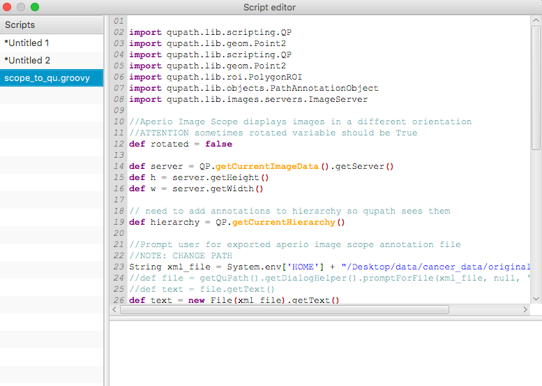

## Baseline Codes for Colorectal Cancer Segmentation

## Summary

Baseline Codes for Colorectal Cancer Segmentation

## Data Processing with Qupath

### Import Aperio-ImageScope formated image into QuPath 

1. Import original image
<p align="center"></p>

2. Run ```scope_to_qu.groovy``` via Automate-Show script editor
<p align="center"></p>

* Change following variable:
    * ```xml_file```

3. Result
<p align="center"></p>

### Annotate tissues within one-touch

1. Analysis - Preprocessing - Simple tissue detection

2. Control Threshold and options (In this case, I take 210 as threshold)(Before and After)

<p align="center"></p>

### Export annotated image file by patch
1. Import original image
<p align="center"></p>

2. Run ```patch_maker.groovy``` via Automate-Show script editor
<p align="center"></p>

* Change following variables:
    * ```maxTileSize```
    * ```pathOutput```

3. Result
<p align="center"></p>

### Data filtering for trainalbe formatted data
```bash
$ python data_filter.py --root ./root --ratio 7 2 1
```
Above code generate file directory as follows:

    ├── root
        ├── train                   
        │   ├── image                # Train images (Background images which do not include annotation included)
        │   ├── label                # Label images (Corresponding with partial images)
        │   └── annotation.txt       # Information that indicate whether image file includes tissue or not
        ├── val                    
        │   ├── image                # Validation images (Background images which do not include annotation included)
        │   ├── label                # Label images (Corresponding with partial images)
        │   └── annotation.txt       # Information that indicate whether image file includes tissue or not         
        ├── test                    
        │   ├── image                # Test images (Background images which do not include annotation included)
        │   ├── label                # Label images (Corresponding with partial images)
        │   └── annotation.txt       # Information that indicate whether image file includes tissue or not       
        └── ...

## Training models

### To train classifier model

```bash
$ python main.py --task=cls --mode=train --n_epochs=100 \
                 --train_batch_size=16 --val_batch_size=16 --lr=1e-5 \
                 --train_data_path=./root/train --val_data_path=./root/val \
                 --sample_save_path=./sample --model_save_path=./model \
                 --use_tensorboard=True --n_gpus=2
```

### To train segmentation model
```bash
$ python main.py --task=seg --mode=train --n_epochs=100 \
                 --train_batch_size=16 --val_batch_size=16 --lr=1e-5 \
                 --train_data_path=./root/train --val_data_path=./root/val \
                 --sample_save_path=./sample --model_save_path=./model \
                 --use_tensorboard=True --n_gpus=2
```
### Use tensorboard
```bash
$ tensorboard --logdir runs --port=8008
```

## Inference with new data

It will be updated soon


### TODO
- [x] Complete baseline code and run it
- [x] Add code for utilizing ```Tensorboard``` and ```Visdom```
- [ ] Annotate data thoroughly (10 images for train, validation, test).
- [x] Detect region of tissues. (Currently about 98% accuracy)
- [ ] Add code for handling under sized image data(THEY SHOULD BE REMOVED)
- [ ] Solve VPN problem (I was not able to enter server due to VPN connection problem..?)
- [ ] Implement ```infer``` part


### Reference
* [Google Docs](https://docs.google.com/document/d/1pj6YIFryhjc0neyhv6n7EONVWM9LqmzPijEPcnAQmzM/)
* [QuPath wiki](https://github.com/qupath/qupath/wiki)
* [QuPath author's blog](https://petebankhead.github.io/)

